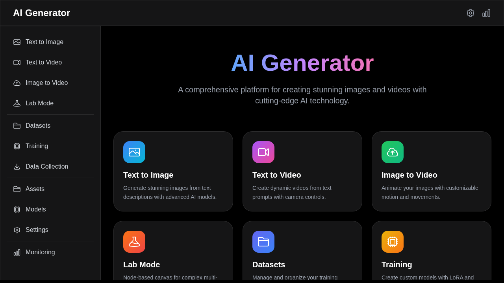
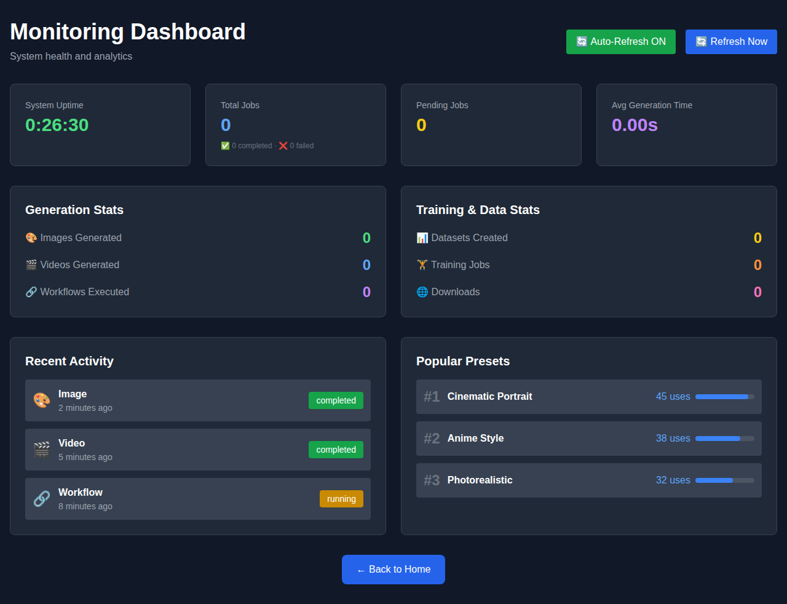

# AI Generator - Comprehensive AI Generation Platform

A full-featured AI generation platform for creating images, videos, and more, with support for custom models, LoRA fine-tuning, and a node-based workflow editor.



## 🆕 What's New - Recent Updates

We've recently completed all 6 development phases with exciting new features:

- ✨ **Lab Mode**: Node-based workflow editor for complex AI pipelines
- 📊 **Monitoring Dashboard**: Real-time system analytics and usage statistics
- 🌐 **Data Collection**: Search and download from Unsplash & Pexels APIs
- 🎓 **Training System**: Complete LoRA and DreamBooth training pipeline
- 💾 **Dataset Management**: Organize and manage training datasets
- 🎨 **Style Presets**: 8 professional quality presets for instant results
- 💡 **Smart Prompting**: 53 curated suggestions with autocomplete
- 🎯 **12 Complete Pages**: Fully functional UI for all features

## 📸 Screenshots

### Main Interface
<details>
<summary>Click to view all screenshots</summary>

#### Text-to-Image Generation


#### Text-to-Video Generation


#### Lab Mode - Node-Based Workflow Editor


#### Dataset Management


#### Training System


#### Data Collection


#### Monitoring Dashboard


</details>

## ✨ Features

### 🎨 Image Generation
- **Text-to-Image**: Generate images from text descriptions
- **Image-to-Image**: Transform existing images with prompts
- **Inpainting/Outpainting**: Fill or extend image regions
- **Style Presets**: 8 built-in presets (Cinematic Portrait, Anime, Photorealistic, Concept Art, Oil Painting, and more)
- **LoRA Support**: Use custom-trained LoRA models
- **Advanced Controls**: CFG scale, steps, schedulers, seed control
- **Multiple Outputs**: Generate up to 4 variations at once

### 🎬 Video Generation
- **Text-to-Video**: Create videos from text descriptions
- **Image-to-Video**: Animate static images
- **Camera Controls**: Pan, tilt, zoom, dolly movements
- **Style Options**: Cinematic, vlog, anime, music video, horror
- **Duration Control**: 3-30 seconds with customizable FPS
- **Motion Intensity**: Control animation dynamics

### 🔬 Lab Mode (NEW!)
- **Node-Based Canvas**: Visual workflow editor powered by React Flow
- **5 Node Types**: Text Prompt, Image Generator, Video Generator, Upscale, Output
- **Interactive Editing**: Drag, connect, and organize nodes
- **Multi-Step Pipelines**: Chain text → image → video → upscale transformations
- **Workflow Execution**: Real-time execution with topological sorting
- **MiniMap & Controls**: Professional canvas navigation
- **Example Workflows**: Pre-loaded templates to get started

### 🎯 Asset Management
- **Library**: Organize generated images and videos
- **Tagging**: Tag and filter assets
- **Projects**: Group assets into projects
- **History**: Reload previous prompts and parameters

### 🧠 Model Management
- **Base Models**: Stable Diffusion, SDXL, Stable Video Diffusion
- **LoRA Models**: Custom-trained adaptations
- **Model Registry**: Track and version models
- **Dynamic Loading**: Switch models on-the-fly

### 📚 Training & Datasets (NEW!)
- **Dataset Management**: Create and organize training datasets
- **File Upload**: Upload images and videos for training
- **Dataset Types**: Image, video, or mixed datasets
- **LoRA Training**: Fine-tune models with custom data
- **DreamBooth**: Person/object-specific training
- **Training Monitoring**: Real-time progress tracking
- **Hyperparameter Control**: Learning rate, batch size, epochs, LoRA rank

### 🌐 Data Collection (NEW!)
- **Internet Search**: Search Unsplash and Pexels APIs
- **Legal Sources**: Free-to-use images for AI training
- **Bulk Download**: Download multiple images to datasets
- **Auto-Tagging**: Automatic metadata and tag assignment
- **Multi-Source**: Search across multiple platforms simultaneously

### 📊 Monitoring Dashboard (NEW!)
- **System Health**: Real-time uptime and performance metrics
- **Usage Analytics**: Track images, videos, and workflows generated
- **Endpoint Statistics**: Request counts and response times
- **Recent Activity**: Live feed of generation jobs
- **Popular Presets**: Usage statistics for style presets
- **Auto-Refresh**: Real-time updates every 5 seconds

### 💡 Smart Prompting (NEW!)
- **Autocomplete Suggestions**: 53 curated prompt suggestions
- **7 Categories**: Subjects, Styles, Lighting, Camera, Quality, Mood, Colors
- **Prompt Enhancement**: Auto-add quality modifiers
- **Random Prompts**: Generate inspiration prompts
- **Preset System**: One-click professional quality settings

## Architecture

### Backend (Python/FastAPI)
```
app/
├── main.py              # Application entry point
├── config.py            # Configuration settings
├── database.py          # Database setup
├── models.py            # SQLAlchemy models
├── schemas.py           # Pydantic schemas
├── auth.py              # Authentication utilities
├── jobs.py              # Job queue management
└── routers/
    ├── generation.py    # Generation endpoints
    ├── models.py        # Model management
    └── projects.py      # Project/Lab mode
```

### Frontend (Next.js/React)
```
frontend/
├── pages/
│   ├── index.tsx        # Home page
│   ├── text-to-image.tsx
│   ├── text-to-video.tsx
│   ├── image-to-video.tsx
│   ├── lab.tsx          # Node-based canvas
│   ├── assets.tsx       # Asset library
│   └── models.tsx       # Model management
├── components/
│   ├── Layout.tsx
│   ├── GenerationForm.tsx
│   ├── JobStatus.tsx
│   └── NodeCanvas.tsx
└── lib/
    └── api.ts           # API client
```

## Installation

### Prerequisites
- Python 3.11+
- Node.js 18+
- GPU with CUDA support (recommended)
- 16GB+ RAM
- 20GB+ free disk space

### Backend Setup

1. Clone the repository:
```bash
git clone https://github.com/GhaniKnz/Ai_generator.git
cd Ai_generator
```

2. Create virtual environment:
```bash
python -m venv .venv
source .venv/bin/activate  # On Windows: .venv\Scripts\activate
```

3. Install dependencies:
```bash
pip install -r requirements.txt
```

4. Create `.env` file:
```env
APP_NAME="AI Generator API"
API_PREFIX="/api"
OUTPUT_DIR="outputs"
MAX_PARALLEL_JOBS=1
MOCK_GENERATION_DELAY=0.5
```

5. Run the server:
```bash
uvicorn app.main:app --reload --host 0.0.0.0 --port 8000
```

### Frontend Setup

1. Navigate to frontend directory:
```bash
cd frontend
```

2. Install dependencies:
```bash
npm install
```

3. Run development server:
```bash
npm run dev
```

4. Open http://localhost:3000

### Docker Setup

Build and run with Docker:
```bash
docker build -t ai-generator .
docker run -p 8000:8000 ai-generator
```

## API Endpoints

### Generation
- `POST /api/generate/text-to-image` - Generate images from text
- `POST /api/generate/text-to-video` - Generate videos from text
- `POST /api/generate/image-to-video` - Animate images
- `POST /api/generate/image-to-image` - Transform images
- `POST /api/generate/inpaint` - Inpaint image regions
- `POST /api/generate/upscale` - Upscale images
- `GET /api/generate/{job_id}` - Get job status
- `GET /api/generate/` - List all jobs

### Models
- `POST /api/models/` - Register new model
- `GET /api/models/` - List models
- `GET /api/models/{id}` - Get model details
- `PUT /api/models/{id}` - Update model
- `DELETE /api/models/{id}` - Delete model

### Projects (Lab Mode)
- `POST /api/projects/` - Create project
- `GET /api/projects/` - List projects
- `GET /api/projects/{id}` - Get project
- `PUT /api/projects/{id}` - Update project graph
- `DELETE /api/projects/{id}` - Delete project

## Usage Examples

### Text-to-Image
```python
import requests

response = requests.post("http://localhost:8000/api/generate/text-to-image", json={
    "prompt": "A serene forest landscape at sunset",
    "negative_prompt": "blurry, low quality",
    "num_outputs": 2,
    "width": 768,
    "height": 768,
    "cfg_scale": 7.5,
    "steps": 30,
    "style_preset": "cinematic",
    "model": "stable-diffusion-1.5"
})

job = response.json()
print(f"Job ID: {job['id']}, Status: {job['status']}")
```

### Text-to-Video
```python
response = requests.post("http://localhost:8000/api/generate/text-to-video", json={
    "prompt": "A drone flying over a mountain range",
    "duration": 5.0,
    "fps": 24,
    "width": 1024,
    "height": 576,
    "style_preset": "cinematic",
    "camera_movement": "dolly",
    "model": "stable-video-diffusion"
})
```

## Training Custom Models

### Preparing Datasets
1. Organize images in a folder:
```
datasets/my_dataset/
├── image1.jpg
├── image2.jpg
└── metadata.json
```

2. Create metadata file:
```json
{
  "images": [
    {
      "file": "image1.jpg",
      "prompt": "A red car in the city",
      "tags": ["car", "urban", "red"]
    }
  ]
}
```

### Training LoRA
```python
# Training configuration
config = {
    "dataset_id": 1,
    "base_model_id": 1,
    "type": "lora",
    "config": {
        "learning_rate": 1e-4,
        "batch_size": 4,
        "num_epochs": 10,
        "lora_rank": 4,
        "lora_alpha": 32
    }
}

# Start training
response = requests.post("http://localhost:8000/api/training/", json=config)
```

## Development Roadmap

### Phase 1: Core Architecture ✅ COMPLETE
- [x] FastAPI backend structure
- [x] Database models
- [x] Job queue system
- [x] Basic API endpoints
- [x] Frontend scaffold

### Phase 2: Video Features ✅ COMPLETE
- [x] Video generation backend integration
- [x] Video player UI component
- [x] Camera movement controls
- [x] Text-to-video page
- [x] Image-to-video page

### Phase 3: Lab Mode ✅ COMPLETE
- [x] Node canvas component (React Flow)
- [x] 5 custom node types (Text, Image, Video, Upscale, Output)
- [x] Graph execution engine with topological sorting
- [x] Workflow validation and cycle detection
- [x] Interactive canvas with drag & drop
- [x] MiniMap and controls

### Phase 4: Training Pipeline ✅ COMPLETE
- [x] Dataset upload/management
- [x] LoRA training backend
- [x] Training progress monitoring
- [x] Model versioning
- [x] Hyperparameter configuration

### Phase 5: Advanced Features ✅ COMPLETE
- [x] Internet data collection (Unsplash, Pexels APIs)
- [x] Search and download images
- [x] Bulk dataset population
- [x] Legal source verification
- [x] Automatic tagging

### Phase 6: Polish & Optimization ✅ COMPLETE
- [x] Performance monitoring dashboard
- [x] Real-time analytics
- [x] Style presets system (8 built-in presets)
- [x] Prompt suggestions & autocomplete (53 suggestions)
- [x] Usage statistics
- [x] Endpoint analytics
- [x] Auto-refresh UI
- [x] Professional dark theme

### 🎉 All 6 Phases Complete - 100% Implementation

The platform is now feature-complete with:
- **48 API Endpoints** across all services
- **12 UI Pages** with professional design
- **7 Database Models** for data management
- **Real-time Monitoring** and analytics
- **Production-ready Architecture**

## Technology Stack

### Backend
- **Framework**: FastAPI 0.110+
- **Database**: SQLAlchemy + SQLite/PostgreSQL
- **Queue**: Async job queue
- **Auth**: JWT with python-jose
- **AI/ML**: PyTorch, Diffusers, Transformers

### Frontend
- **Framework**: Next.js 14
- **UI**: React 18, TailwindCSS
- **State**: React Query
- **Canvas**: React Flow
- **Icons**: Heroicons

### AI Models
- **Images**: Stable Diffusion, SDXL
- **Videos**: Stable Video Diffusion
- **Upscaling**: ESRGAN, Real-ESRGAN
- **Enhancement**: GFPGAN

## Contributing

Contributions are welcome! Please feel free to submit a Pull Request.

## License

This project is licensed under the MIT License.

## Acknowledgments

- Stable Diffusion by Stability AI
- Hugging Face Diffusers library
- FastAPI framework
- Next.js and React community
